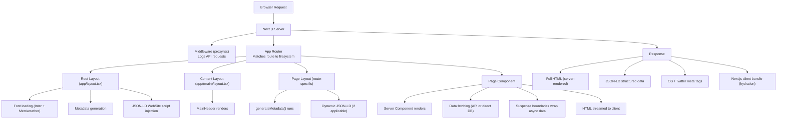
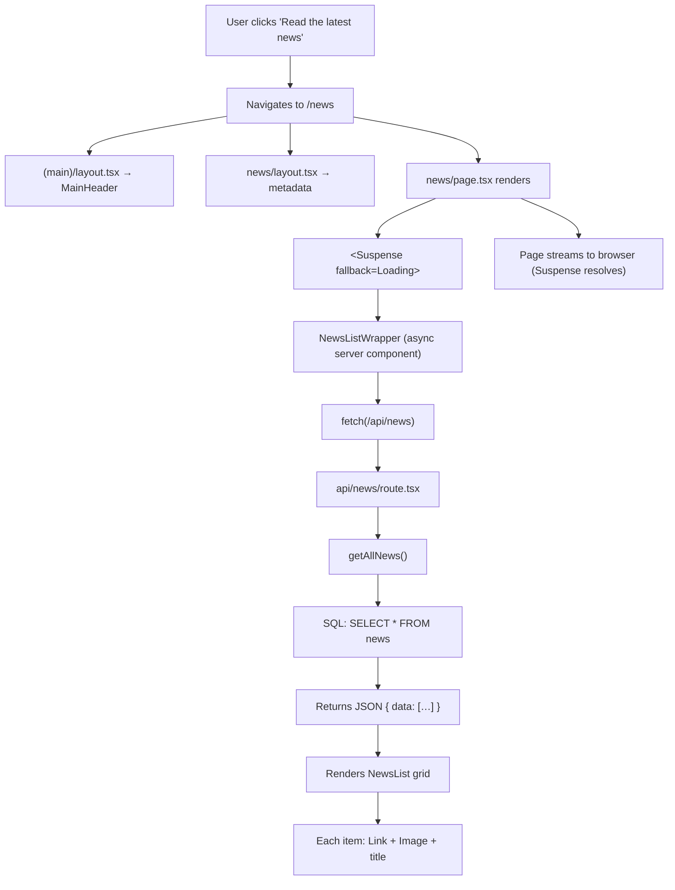
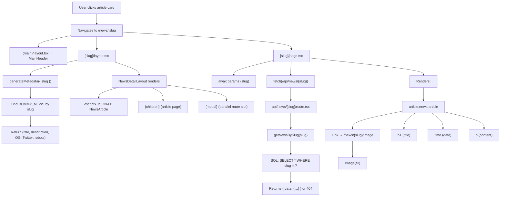
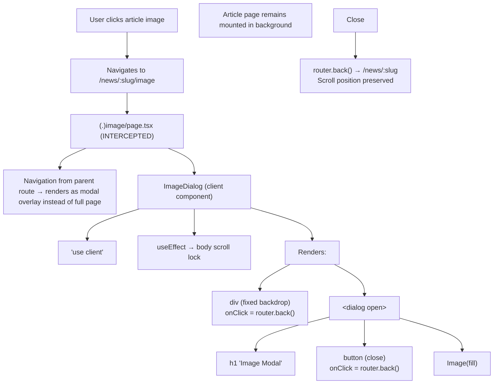
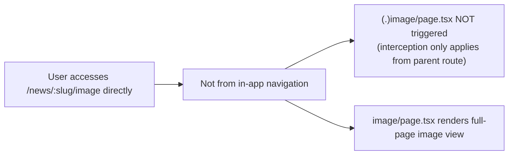
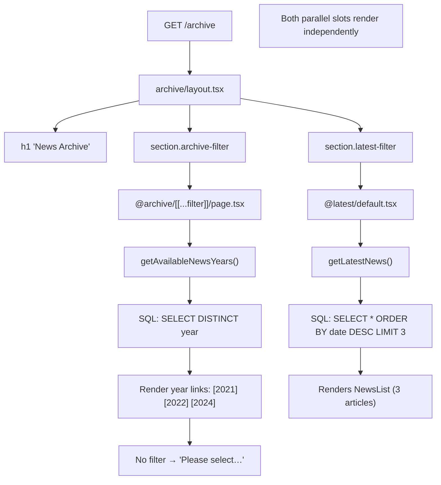
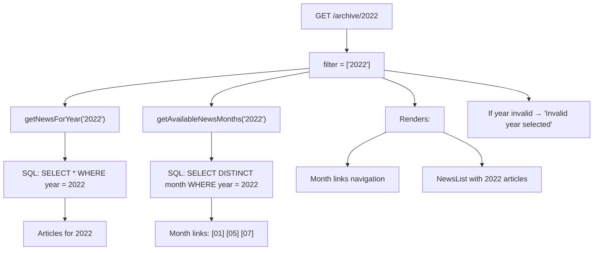
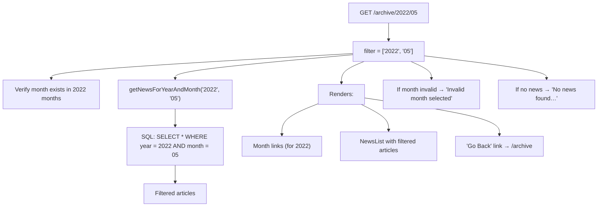
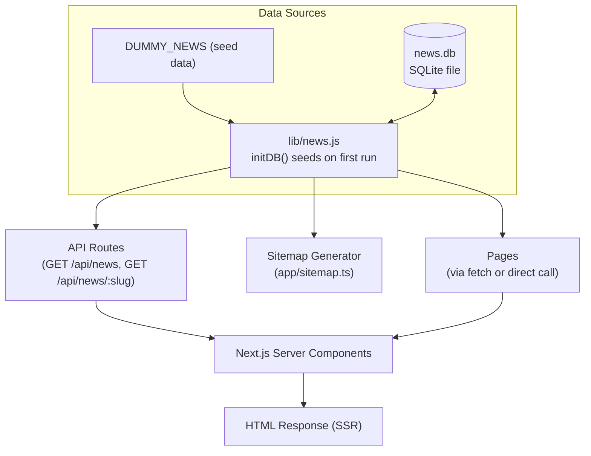
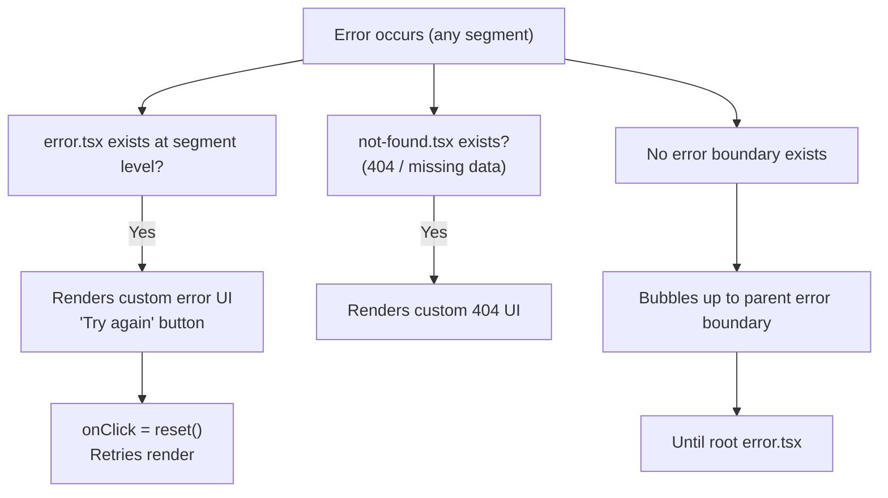

# Program Flow — NextNews

> Detailed walkthrough of the request lifecycle, navigation flows, and data flow from database to UI.

---

## 1. Request Lifecycle Overview

---

## 2. Navigation Flows

### 2.1 Homepage → News Listing

### 2.2 News Listing → Article Detail

### 2.3 Article → Image Modal (Intercepted)

### 2.4 Direct URL Access (Non-Intercepted)

---

## 3. Archive Navigation Flow

### 3.1 No Filter Selected

### 3.2 Year Filter Selected

### 3.3 Year + Month Filter Selected

---

## 4. Data Flow Diagram

---

## 5. Error Handling Flow

