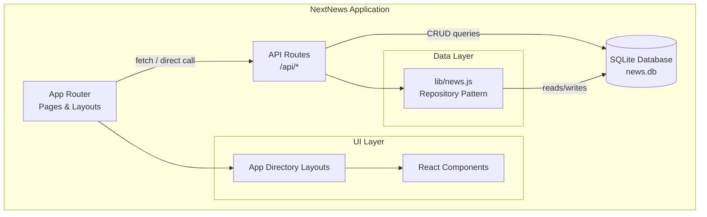
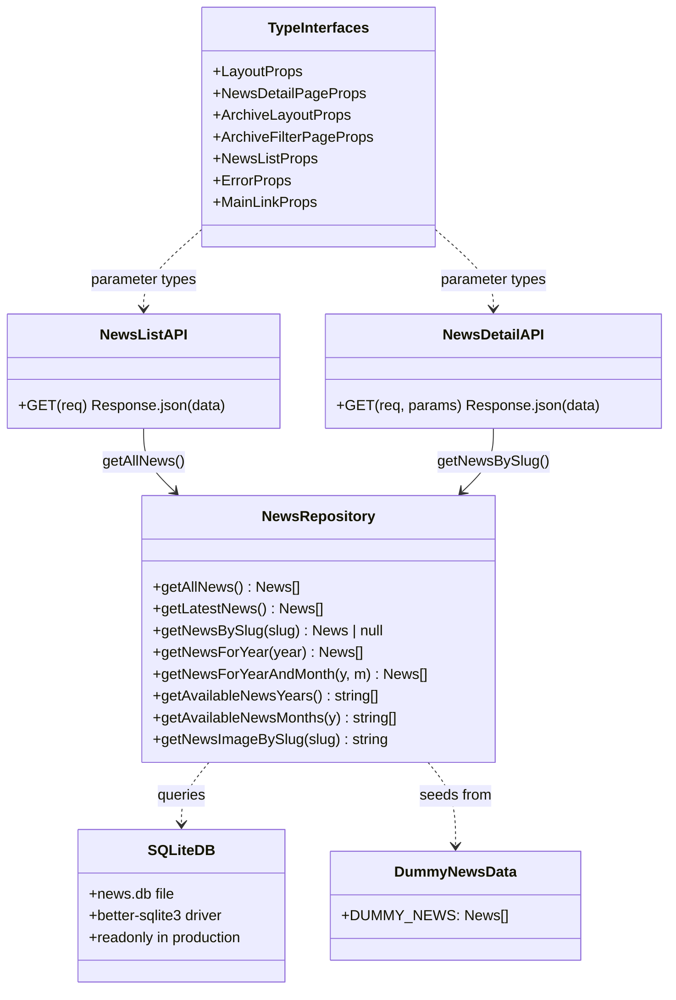
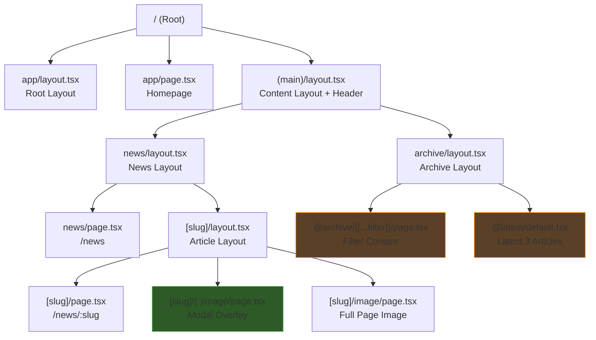
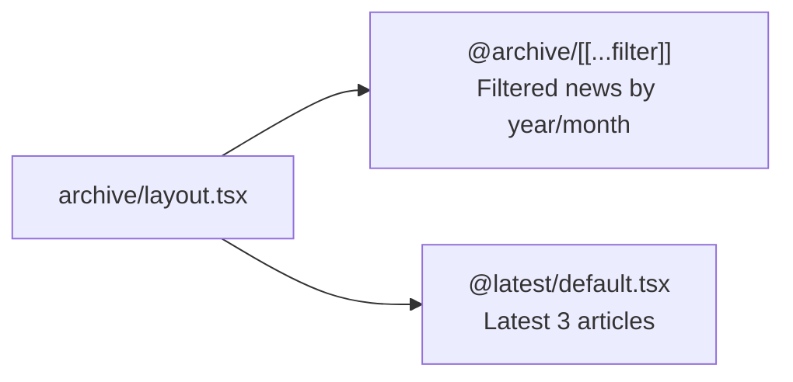
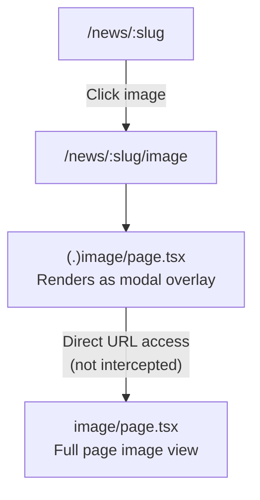
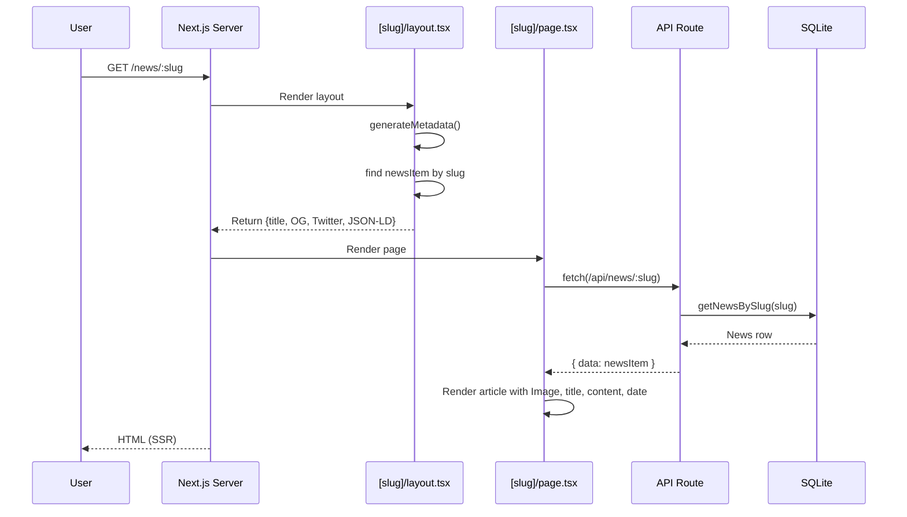
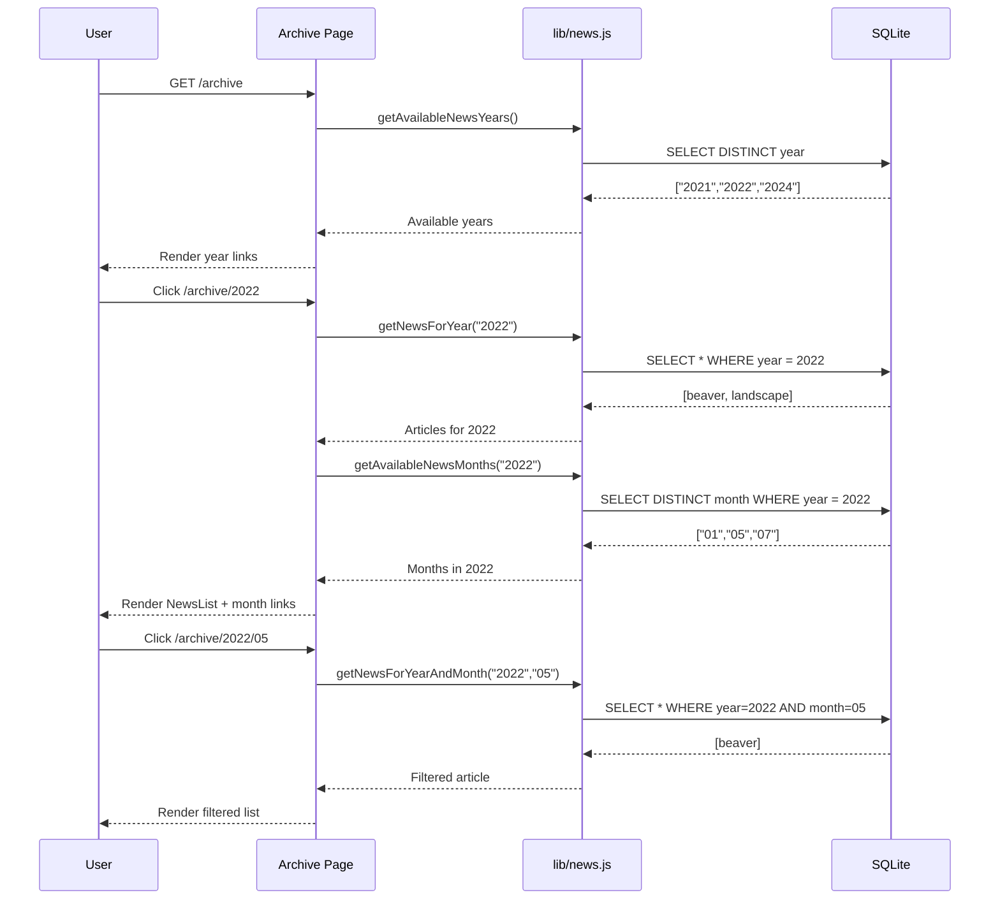
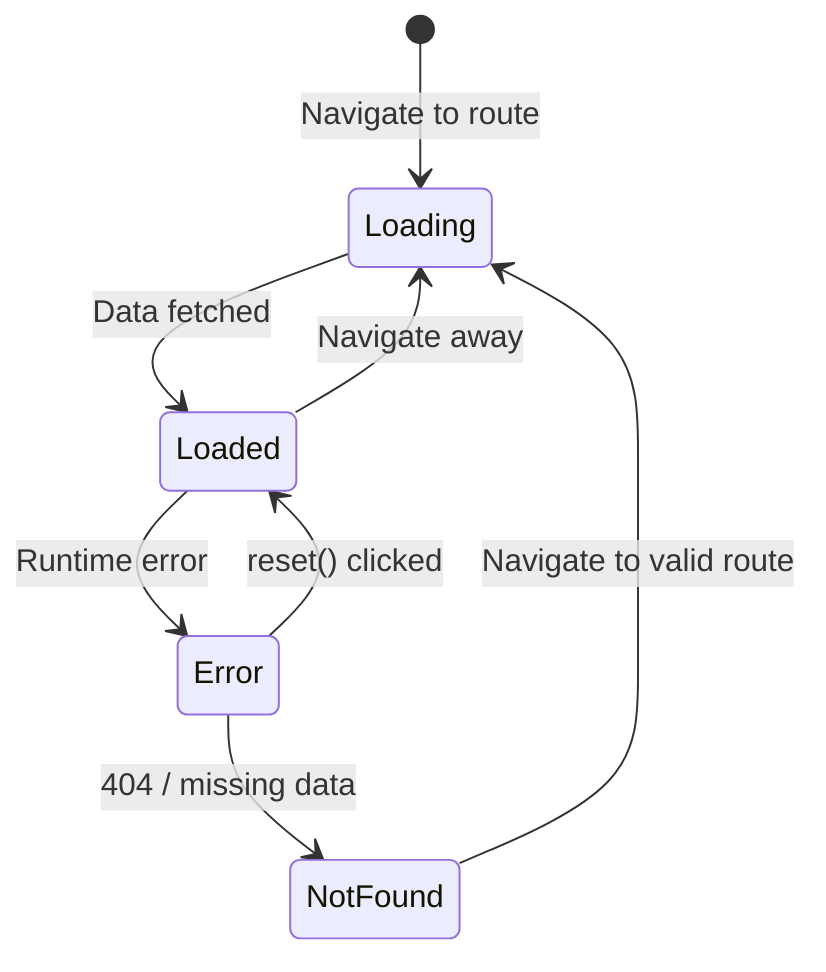
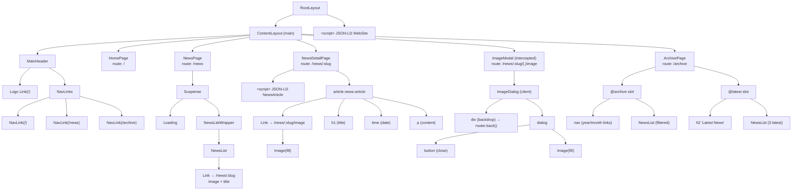

# UML Diagrams — NextNews

> These diagrams describe the system architecture, component hierarchy, and request lifecycles for the NextNews application.

---

## 1. Component Diagram

Shows the high-level software components and their dependencies.

---

## 2. Module Diagram

Illustrates the key modules, their interfaces, and relationships.

---

## 3. Route Hierarchy Diagram

Shows the Next.js App Router file-based route nesting and parallel/intercepting route relationships.

### Parallel Routes

### Intercepting Route

---

## 4. Sequence Diagram — Article Request Lifecycle

Shows the flow when a user navigates to a news article detail page.

---

## 5. Sequence Diagram — Archive Navigation Flow

Shows the flow when a user navigates through the archive filter.

---

## 6. State Diagram — Page States

Shows the possible states for any page/route segment.

---

## 7. Component Tree

